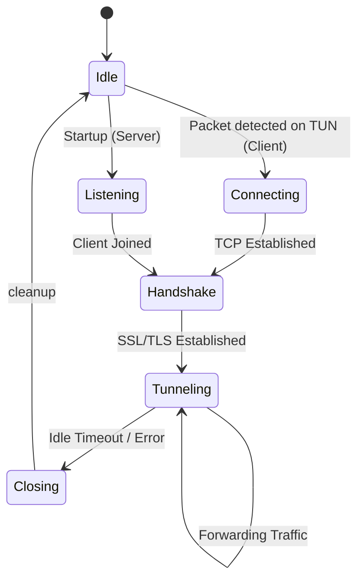

# SSL-TUN-TUNNEL Protocol Specification

This document describes the application-layer protocol used by `ssl-tun-tunnel` to encapsulate Layer 3 (IP) traffic over an SSL/TLS-secured TCP stream.

## 1. Framing Format

Each unit of data (packet or junk) sent over the SSL socket is prefixed with a **2-byte Big-Endian Length Header**.

```text
 0                   1
 0 1 2 3 4 5 6 7 8 9 0 1 2 3 4 5
+-+-+-+-+-+-+-+-+-+-+-+-+-+-+-+-+
|J|           Length            |
+-+-+-+-+-+-+-+-+-+-+-+-+-+-+-+-+
|                               |
/            Payload            /
|                               |
+-+-+-+-+-+-+-+-+-+-+-+-+-+-+-+-+
```

### Fields:
- **J (Junk Bit, 1 bit)**: Bit index 0. If set (0x8000), the following payload is random noise and should be discarded by the receiver.
- **Length (15 bits)**: The size of the payload in bytes (maximum 32,767 bytes).
- **Payload**: The raw IP packet (if J=0) or random bytes (if J=1).

## 2. Transmission Logic

The tunnel operates in two modes: **Direct** and **Buffered**.

### Direct Mode (Standard)
When buffering is disabled, every IP packet read from the TUN interface is immediately wrapped in a frame and sent over the SSL socket.

### Buffered Mode (Batching)
When enabled, packets are collected in an internal queue before being sent as a single "bunch" of frames. This reduces the number of small TCP segments and SSL record overhead.

#### Flush Algorithms
The buffer is "flushed" (sent) when any of the following conditions are met:
1. **Size Flush**: The total size of buffered packets reaches the `TCP_MSS_FLUSH_THRESHOLD` (default: 1450 bytes). This ensures the batch typically fits within a single standard MTU Ethernet frame.
2. **Timeout Flush**: The `flush_timeout` (default: 1.0s) has elapsed since the last flush.
3. **Priority Flush**: A packet with a specific DSCP/ToS value (matching the `--low-latency-dscp` set) is detected. The buffer is flushed immediately to ensure minimal delay for real-time traffic (e.g., DNS, SSH, VoIP).

## 3. Traffic Obfuscation (Random Fill)

To disguise traffic patterns and packet sizes, the protocol supports padding batches to a constant size.

### Fill Algorithms
If a fill mode is active (`all` or `throughput`), the system calculates the remaining space in the current batch relative to the `TCP_MSS_FLUSH_THRESHOLD`.
- **`all`**: Every batch is padded with a junk frame to reach the threshold.
- **`throughput`**: Only batches triggered by size or timeout are padded. Priority flushes (low-latency) are sent without padding to avoid adding extra transmission time.

## 4. Connection Lifecycle



### Timeouts
- **Idle Timeout**: If no data is read or written for `idle_timeout` seconds, the connection is closed.
- **Reconnect Timeout (Client)**: After a disconnect or error, the client waits `reconnect_timeout` seconds before attempting to reach the server again. If the disconnect was caused by an idle timeout, the client stays idle until new traffic is seen on the local TUN interface.
